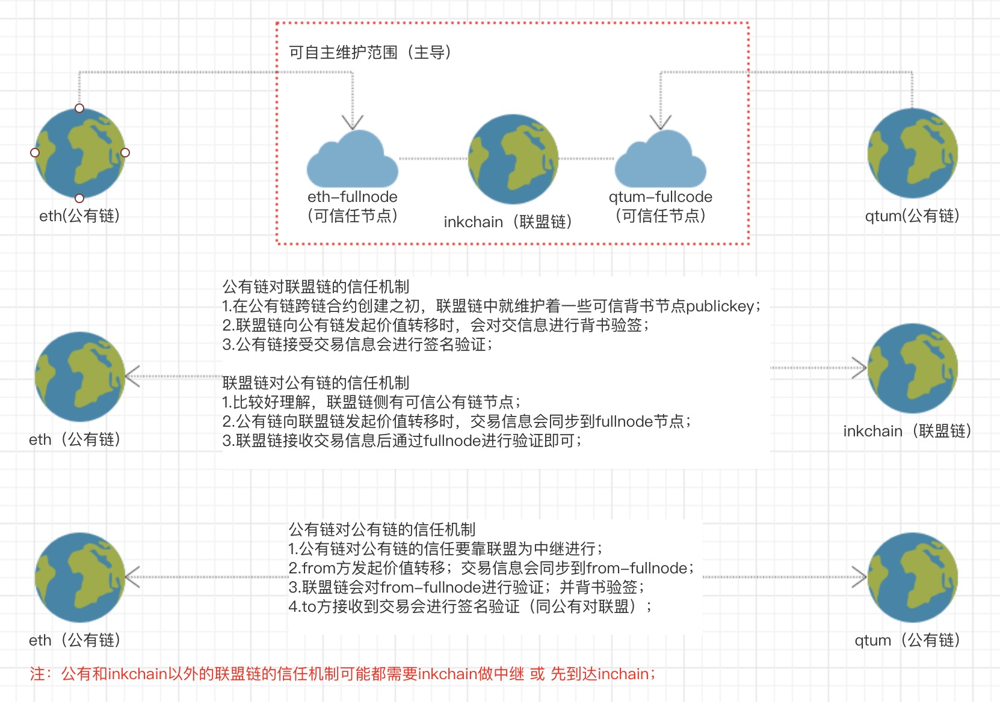
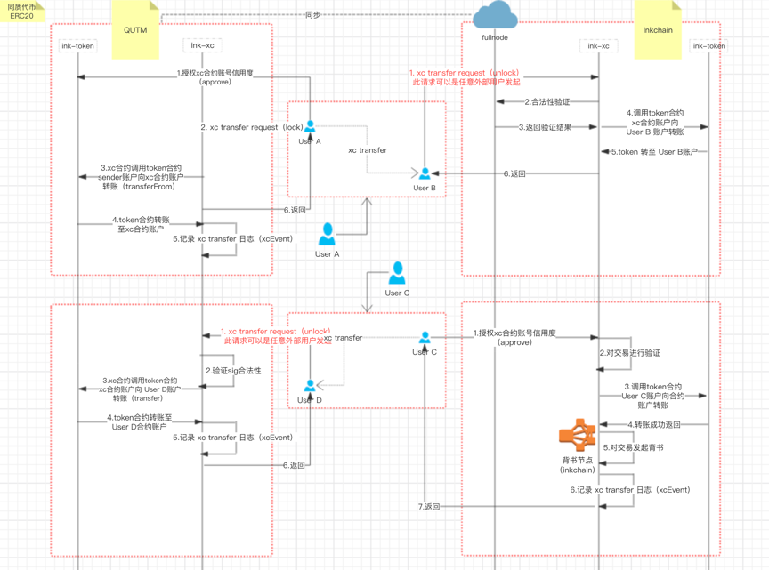

# 跨链合约（XC）

## 跨链网络图



## 跨链交互图
// TODO 部分交互有误，需要进行修改


## 数据结构 

```
library Data {

    enum Errcode {
        Success,    // 成功
        NotOwner,   // 非管理员
        PlatformTypeInvalid,    // 类型无效
        PlatformNameNotNull,    // 不能为空
        CatNotOwenerPlatformName,   // 不能为管理员名称
        NotCredible,    // 不可信
        InsufficientBalance, // 余额不足
        TransferFailed, // 交易失败
        PublickeyNotExist,  // 公钥不存在
        VoterNotChange, // 投票重复
        WeightNotSatisfied  // 权重不足
    }

    struct Admin {
        bytes32 name; // 平台名称
        address account; // 管理员账户
    }

    struct Platform {
        uint8 typ; // 平台类型：1:公有链 2:联盟链
        bytes32 name; // 跨链合约部署平台名称
        uint totalOf; // 对外总开放数量；默认为0；（当前合约总锁死数量）
        uint weight; // 用于各平台验证权重数
        address[] publickeys; // 各平台公信公钥
    }
    
    struct Platform {
        uint8 typ;
        bytes32 name;
        uint weight;
        address[] publickeys;
        mapping(bytes32 => Proposal) proposals;
    }
}

contract XCPlugin {
    Data.Admin private admin;
    mapping(bytes32 => Data.Platform) private platforms;
}

contract XC {
    Data.Admin private admin;
    mapping(bytes32 => uint) public balanceOf;
}
```

> 1）Data.Errcode : 返回值
> 
> 2）Data.Admin : 合约管理员
> 
> 3）Data.Platform : 链码平台
>
> 4）XCPlugin.platforms : 可信链码平台
> 
> 5）XC.balanceOf : 跨链金额；XC.balanceOf[admin.name]为XC合约锁金额；XC.balanceOf[platformName]为向某平台转额总数；

备注：balanceOf 用于核对各平台之间转账平账；


## 事件

```
contract XC {
    event lockEvent(bytes32 toPlatform, address toAccount, string amount);
    event unlockEvent(bytes32 txid,bytes32 fromPlatform,address fromAccount ,string amount);
}
```

> 跨链事件,跨链交易时触发；

## 接口 

```
interface XCInterface {

    function setAdmin(address account) external;
    function getAdmin() external constant returns (address);
    
    function setINK(address account) external;
    function getINK() external constant returns (address);
    
    function setXCPlugin(address account) external;
    function getXCPlugin() external constant returns (address);
    
    function lockAdmin(bytes32 toPlatform, address toAccount, uint amount) external payable returns (Data.Errcode);
    function unlockAdmin(bytes32 fromPlatform,address fromAccount, address toAccount, uint amount, bytes32 txid) external payable returns (Data.Errcode);
    
    function withdrawal(address account,uint amount) external payable returns (Data.Errcode);
    
    function lock(bytes32 toPlatform, address toAccount, uint amount) external  payable returns (Data.Errcode);
    function unlock(bytes32 fromPlatform,address fromAccount, address toAccount, uint amount, bytes32 txid) external payable returns (Data.Errcode);  
}
```
> 1）setAdmin 和 getAdmin 用于维护合约管理员，可转移；
>
> 2）setINK、getINK、setXCPlugin、getXCPlugin 用于维护INK、XCPlugin的合约；可以更换升级；
>
> 3）lockAdmin、unlockAdmin 管理员跨链平账使用；
>
> 4）withdrawal 用于提取别人误转到合约上的金额；
>
> 5）lock 和 unlock 用于跨链转入转出；
> 

备注：1）2）3） 4） 为管理员维护接口；5）为开放接口；

```
interface XCPluginInterface { 

    function voter(bytes32 name, bytes32 txid, bytes sig) external returns (Data.Errcode errcode,bool verify);
    function verify(bytes32 name, bytes32 txid) external constant returns (Data.Errcode);
    function deleteProposal(bytes32 platformName, bytes32 txid) external constant returns (Data.Errcode);
    
    function setAdmin(bytes32 name,address account) external;
    function getAdmin() external constant returns (bytes32,address);
    
    function addPlatform(uint8 typ, bytes32 name) external returns (Data.Errcode);
    function deletePlatfrom(bytes32 name) external constant returns (Data.Errcode);
    function getPlatfrom(bytes32 name) external returns (Data.Errcode errcode, uint8 typ, bytes32 name, uint balance, uint weight, address[] publickeys);
    function existPlatfrom(bytes32 name) external constant returns (bool);
    
    function setWeight(bytes32 name, uint weight) external returns (Data.Errcode);
    function getWeight(bytes32 name) external constant returns (Data.Errcode, uint);
    
    function addPublickey(bytes32 platfromName, address publickey) external constant returns (Data.Errcode);
    function deletePublickey(bytes32 platfromName, address publickey) external returns (Data.Errcode);
    function countOfPublickey(bytes32 platfromName) external constant returns (Data.Errcode, uint);
}
```
> 1）setAdmin 和 getAdmin 用于维护合约管理员，可转移；
>
> 2）addPlatform、deletePlatfrom、getPlatfrom、existPlatfrom 用于维护可信链码平台信息；
>
> 3）addPublickey、deletePublickey、countOfPublickey 用于维护可信链码平台可信公钥；
>
> 4）setWeight、getWeight 用于维护可信链码平台权重数；
>
> 5）voter 验签投票、verify 验证跨链交易合法性、deleteProposal 移除投票提案'；
> 

备注：1）2）3）4）为管理员维护接口；5）为开放接口，其中 voter 为其他链码平台使用、verify、deleteProposal 为当前链码平台使用；

## 合约

```
contract INK {}
contract XCPlugin {}
contract XC {
    INK private inkToken;
    XCPlugin private xcPlugin;
}
```
> 1） INK 为 Token合约；XCPlugin 为跨链功能合约；XC 为跨链合约；
>
> 2）INK、XCPlugin 为XC功能插件合约；
> 

## 使用

### 安装INK合约
略
### 安装XCPlugin合约
```
1）通过 addPlatform、deletePlatfrom、getPlatfrom、existPlatfrom 方法维护可信平台信息；
2）通过 addPublickey、deletePublickey、countOfPublickey 方法维护可信平台的可信公钥信息；
3）通过 setWeight、getWeight 方法设置各个可信平台的验证权重；
```

### 安装XC合约；

```
1）在XC合约上，通过setINK、setXCPlugin 方法，设置INK合约、XCPlugin合约；通过getINK、getXCPlugin 方法检验；
2）
```

### 问题

```
1）合约间的信任关系；
2）合约的开关，软性的控制是否对外提供服务；
3）合约的注销函数和机制；
```